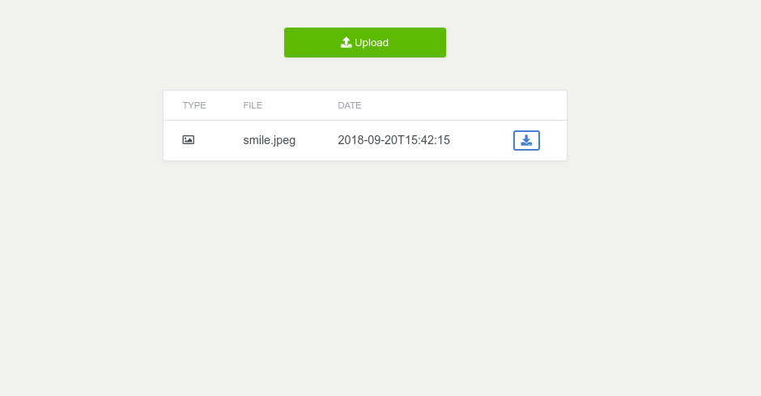
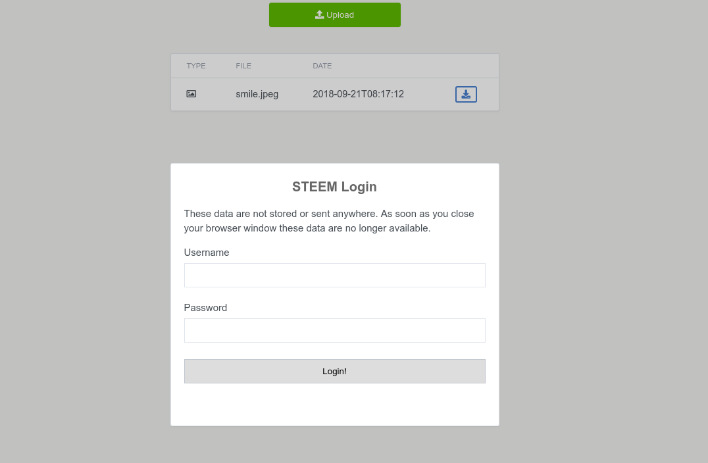

STEEM To File Upload
======

This is the first real file upload client for the STEEM Blockchain
This app was developed during the Utopian [Hackathon](https://steemit.com/fundition-ffdnxgdga/@steemstem/utopian-hackathon-revealing-date-topic-prizes-and-more-details-on-the-first-utopian-io-community-hackathon) by dehenne and mordark.

*The app is currently using the testnet*

Preview
------

Requirements / Browser support
------

This app is developed on the latest browser standards. 
Older browsers are therefore not supported.

We recommend: 

- Chrome 69 and higher
- Firefox 62 and higher
- Edge

Goal
------

The goal was:

- to demonstrate how the STEEM blockchain can be utilised
- how files can be edited, uploaded and downloaded using only a browser

Missing functionality
------

Since this app was cut together under time pressure some functions are missing 
which guarantee a correct use. In the next days / weeks these will be integrated.

- [ ] Compression of the uploaded files
- [ ] Login window
- [ ] Upload progress bar - user must see the upload progress
- [ ] Real dApp
- [ ] Pagination of the file list
- [ ] File upload resume
- [ ] More mime type icons
- [ ] Little bit code cleanup
- [ ] Browser compatibility
- [ ] Fine tuning of the file parameters

What was learned
------

We've learned a lot from it, since the source code is completely free, 
we hope others can learn from it as well.

Among other things, we have learned:

- Use of the dsteem JavaScript library
- ES6 modules (import, export)
- ES6 Arrow Functions (practical experience gained)
- File handling
    - Conversion of a file into different formats and all that in the browser
    - Understanding Uint8Array, Uint16Array and how it can be used
    - FileReader JavaScript API
- Trick for Promise delays :D

Contribution
------

We are looking forward to further ideas, issues or fixes.

License
------

The code is licensed under the MIT license.
Therefore, the presented code is completely free and can be used without any restrictions.
